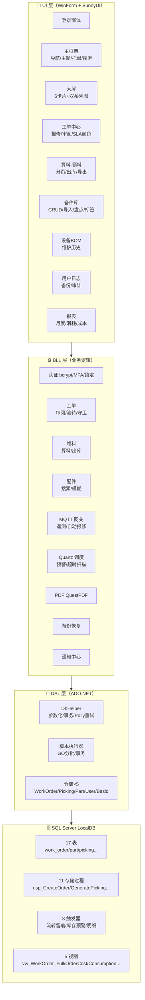
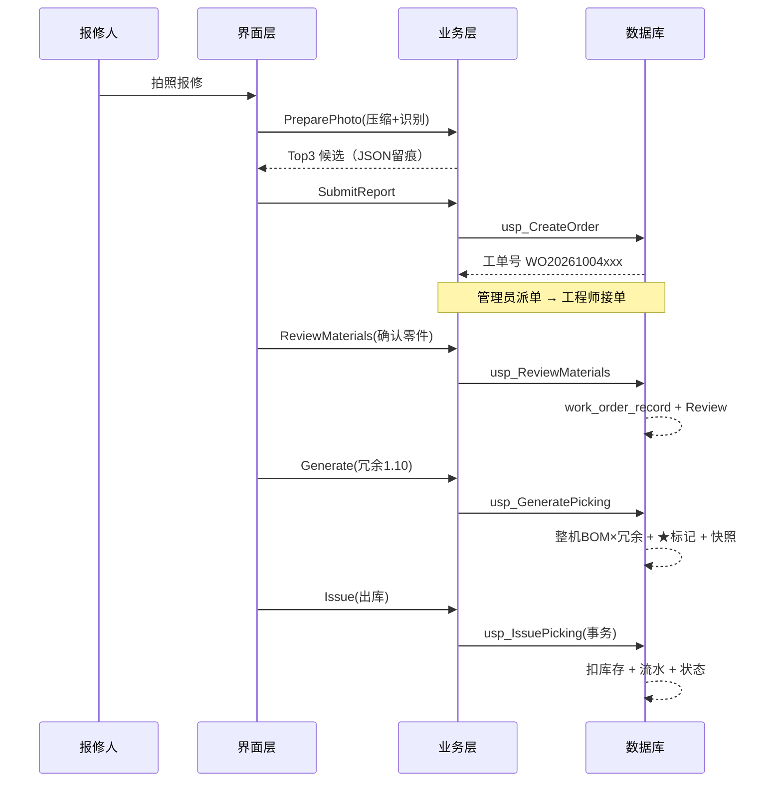
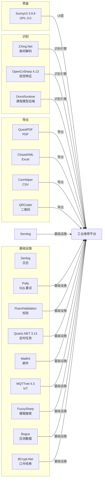

# 架构图（R39，Mermaid 格式）

> 可在 [mermaid.live](https://mermaid.live) 或支持 Mermaid 的 Markdown 预览中渲染。

## 三层架构总览

```mermaid
graph TB
    subgraph UI["🎨 UI 层（WinForm + SunnyUI）"]
        FLogin[登录窗体]
        FMain[主框架<br/>导航/主题/托盘/搜索]
        UcDashboard[大屏<br/>6卡片+双系列图]
        UcWorkOrders[工单中心<br/>报修/审阅/SLA颜色]
        UcPicking[算料·领料<br/>分页/出库/导出]
        UcParts[备件库<br/>CRUD/导入/盘点/标签]
        UcDevices[设备BOM<br/>维护历史]
        UcUsers[用户日志<br/>备份/审计]
        UcReport[报表<br/>月度/消耗/成本]
    end

    subgraph BLL["⚙️ BLL 层（业务逻辑）"]
        AuthService[认证 bcrypt/MFA/锁定]
        WorkOrderService[工单<br/>审阅/流转/守卫]
        PickingService[领料<br/>算料/出库]
        PartService[配件<br/>搜索/模糊]
        MqttGateway[MQTT 网关<br/>遥测/自动报修]
        ScheduleHost[Quartz 调度<br/>预警/超时扫描]
        PdfService[PDF QuestPDF]
        BackupService[备份恢复]
        NotificationCenter[通知中心]
    end

    subgraph DAL["💾 DAL 层（ADO.NET）"]
        DbHelper[DbHelper<br/>参数化/事务/Polly重试]
        ScriptRunner[脚本执行器<br/>GO分批/事务]
        Repos[仓储×5<br/>WorkOrder/Picking/Part/User/Basic]
    end

    subgraph DB["🗄️ SQL Server LocalDB"]
        Tables["17 表<br/>work_order/part/picking..."]
        Procs["11 存储过程<br/>usp_CreateOrder/GeneratePicking..."]
        Triggers["3 触发器<br/>流转留痕/库存预警/明细"]
        Views["5 视图<br/>vw_WorkOrder_Full/OrderCost/Consumption..."]
    end

    UI --> BLL
    BLL --> DAL
    DAL --> DB
```

## 数据流：报修 → 审阅 → 算料 → 出库

```mermaid
sequenceDiagram
    participant R as 报修人
    participant UI as 界面层
    participant BLL as 业务层
    participant DB as 数据库

    R->>UI: 拍照报修
    UI->>BLL: PreparePhoto(压缩+识别)
    BLL-->>UI: Top3 候选（JSON留痕）
    UI->>BLL: SubmitReport
    BLL->>DB: usp_CreateOrder
    DB-->>BLL: 工单号 WO20261004xxx

    Note over BLL,DB: 管理员派单 → 工程师接单

    UI->>BLL: ReviewMaterials(确认零件)
    BLL->>DB: usp_ReviewMaterials
    DB-->>DB: work_order_record + Review

    UI->>BLL: Generate(冗余1.10)
    BLL->>DB: usp_GeneratePicking
    DB-->>DB: 整机BOM×冗余 + ★标记 + 快照

    UI->>BLL: Issue(出库)
    BLL->>DB: usp_IssuePicking(事务)
    DB-->>DB: 扣库存 + 流水 + 状态
```

## 开源组件集成

```mermaid
graph LR
    subgraph 界面
        SunnyUI[SunnyUI 3.9.8<br/>GPL-3.0]
    end

    subgraph 识别
        ZXing[ZXing.Net<br/>条码解码]
        OpenCV[OpenCvSharp 4.13<br/>视觉特征]
        ONNX[OnnxRuntime<br/>课程模型后端]
    end

    subgraph 导出
        QuestPDF[QuestPDF<br/>PDF]
        ClosedXML[ClosedXML<br/>Excel]
        CsvHelper[CsvHelper<br/>CSV]
        QRCoder[QRCoder<br/>二维码]
    end

    subgraph 基础设施
        Serilog[Serilog<br/>日志]
        Polly[Polly<br/>SQL重试]
        FluentValidation[FluentValidation<br/>校验]
        Quartz[Quartz.NET 3.13<br/>定时任务]
        MailKit[MailKit<br/>邮件]
        MQTTnet[MQTTnet 4.3<br/>IoT]
        FuzzySharp[FuzzySharp<br/>模糊搜索]
        Bogus[Bogus<br/>压测数据]
        BCrypt[BCrypt.Net<br/>口令哈希]
    end

    SunnyUI --> |UI层| App[工业维修平台]
    ZXing & OpenCV & ONNX --> |识别引擎| App
    QuestPDF & ClosedXML & CsvHelper & QRCoder --> |导出| App
    Serolog & Polly & FluentValidation & Quartz & MailKit & MQTTnet & FuzzySharp & Bogus & BCrypt --> |基础设施| App
```
